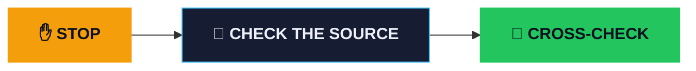

<div class="bg-fade-left"></div>

<div v-motion :initial="{ y: 40, opacity: 0 }" :enter="{ y: 0, opacity: 1, transition: { duration: 700 } }">

<div class="flex gap-4 text-5xl mb-6">
  <span class="i-twemoji-flag-malaysia"></span>
  <span class="i-twemoji-magnifying-glass-tilted-left"></span>
  <span class="i-twemoji-flag-indonesia"></span>
</div>

<h1 class="!text-7xl !mb-3">Saring Sebelum <span class="text-pause">Sharing</span></h1>

<p class="!text-3xl text-muted">Check Before You Share</p>

</div>

<div class="mt-12 text-xl text-muted" v-motion :initial="{ opacity: 0 }" :enter="{ opacity: 1, transition: { delay: 600 } }">
  Web Team · Townhall · 6 Nov 2026
</div>

<!--
[0:00 → 0:15] TITLE — 15 sec

- Quick hello to office + remote folks.
- "Saring sebelum sharing" works in both BM and BI — that's the whole talk in four words.
- Don't linger: go straight into the game.
-->

---
layout: image-right
image: /assets/magnifier.jpg
backgroundSize: cover
transition: fade-out
---

# Quick game: <span class="text-real">real</span> or <span class="text-fake">fake</span>?

<div class="grid grid-cols-1 gap-5 mt-8 text-2xl">
  <div class="card" v-click>
    <span class="i-twemoji-flag-indonesia text-4xl"></span>
    <div class="mt-2">Indonesians vote on <span class="i-twemoji-flag-malaysia"></span> Malaysian items</div>
  </div>
  <div class="card" v-click>
    <span class="i-twemoji-flag-malaysia text-4xl"></span>
    <div class="mt-2">Malaysians vote on <span class="i-twemoji-flag-indonesia"></span> Indonesian items</div>
  </div>
</div>

<p class="mt-8 text-muted" v-click>No Googling. Gut feeling only. <span class="i-twemoji-eyes"></span></p>

<!--
[0:15 → 0:30] HOOK INTRO — 15 sec

- Cross-country twist: you vote on the OTHER country's items, so nobody has local context.
- That's the point: without context, everyone is guessing.
- Remote folks: poll link will be in the chat.
-->

---
clicks: 0
---

# Real or fake?

<div class="grid grid-cols-4 gap-4 mt-4 h-80">
  <FlipCard label="Every Malaysian adult gets RM100 credited to their MyKad. No application needed." kind="A · Headline" flag="my" verdict="REAL" image="/assets/hoax/my-sara-photo.jpg" view-href="https://www.thevibes.com/articles/news/112204/rm100-sara-aid-via-mykad-begins-nationwide-distribution" />
  <FlipCard label="Finance Minister Sri Mulyani: “guru itu beban negara” (teachers are a burden on the state)" kind="B · Video" flag="id" verdict="FAKE" image="/assets/hoax/id-srimulyani-video.jpg" view-href="/assets/hoax/id-srimulyani-viral.mp4" extra-href="https://www.youtube.com/watch?v=Zh02Lzk6px8" extra-label="Real speech ▶" />
  <FlipCard label="TikTok: customer rages at JPJ, “only 1 counter open, staff still on break!”" kind="C · Video" flag="my" verdict="FAKE" image="/assets/hoax/my-jpj-tiktok.jpg" :image-blur="3.5" play />
  <FlipCard label="“KISAH NYATA: man arrested for hoarding coins in water gallons”" kind="D · Image" flag="id" verdict="FAKE" image="/assets/hoax/id-koin-ai.png" view-href="https://www.lpkapnews.com/2026/02/nimbun-uang-koin-di-galon-air-pria-ini.html" />
</div>

<p class="mt-4 text-center text-muted">Pick A, B, C, D: which ones are <span class="text-real">real</span>?</p>

<!--
[0:30 → 1:15] SHOW ITEMS — 45 sec

- Walk through each card in ~10 sec. Indonesians judge A + C (MY), Malaysians judge B + D (ID).
- "Open ↗" on A, B and D opens the item (A: The Vibes article; B: the viral Instagram reel (local copy, no "hoaks" title anywhere; 25 sec, plays in a new tab); D: the "news" page that published the coin story).
- C has no copy online (the TikTok was taken down after the MCMC report). Just describe it.
- On the reveal, card B also has "Real speech ▶": Kompas TV's full ITB speech (7 Aug 2025), the footage the deepfake was cut from.
- A (MY, headline): RM100 on every adult's MyKad, no application. Sounds exactly like a "free money" scam, but it's REAL.
- B (ID, video): clip of Finance Minister Sri Mulyani saying teachers are a burden on the state. Went viral Aug 2025.
- C (MY, video): TikTok clip of a customer arguing at a JPJ counter. Describe it; optional: play the clip if you saved it.
- D (ID, image): "true story" photo of a man arrested for hoarding coins in water gallons.
-->

---
layout: center
---

# Cast your vote <span class="i-twemoji-backhand-index-pointing-down"></span>

<div class="h-80 mt-4 w-200">
  <PollEmbed url="POLL_URL_HERE" title="Real or fake? A · B · C · D" />
</div>

<!--
[1:15 → 1:45] POLL — 30 sec

- TODO: create the opening poll (Slido/Mentimeter), paste the URL into PollEmbed (both here and the closing poll).
- Office: scan the QR. Remote: link in chat.
- If the iframe is blocked on the venue network, the QR + link still works. Switch to the poll tab instead.
-->

---
clicks: 5
---

# The reveal

<div class="grid grid-cols-4 gap-4 mt-4 h-80">
  <FlipCard label="Every Malaysian adult gets RM100 credited to their MyKad. No application needed." kind="A · Headline" flag="my" verdict="REAL" image="/assets/hoax/my-sara-photo.jpg" view-href="https://www.thevibes.com/articles/news/112204/rm100-sara-aid-via-mykad-begins-nationwide-distribution" reason="SARA one-off RM100, usable 31 Aug–31 Dec 2025." back-image="/assets/screenshots/my-sara.png" href="https://www.thevibes.com/articles/news/112204/rm100-sara-aid-via-mykad-begins-nationwide-distribution" :flipped="$clicks >= 1" />
  <FlipCard label="Finance Minister Sri Mulyani: “guru itu beban negara” (teachers are a burden on the state)" kind="B · Video" flag="id" verdict="FAKE" image="/assets/hoax/id-srimulyani-video.jpg" view-href="/assets/hoax/id-srimulyani-viral.mp4" extra-href="https://www.youtube.com/watch?v=Zh02Lzk6px8" extra-label="Real speech ▶" reason="She never said it. Real speech, cut + fake caption. She called it HOAX." back-image="/assets/screenshots/id-srimulyani.png" href="https://ekonomi.republika.co.id/berita/t18wf6409/sri-mulyani-bantah-sebut-guru-beban-negara-cap-video-viral-hoaks-hasil-deepfake" :flipped="$clicks >= 2" />
  <FlipCard label="TikTok: customer rages at JPJ, “only 1 counter open, staff still on break!”" kind="C · Video" flag="my" verdict="FAKE" image="/assets/hoax/my-jpj-tiktok.jpg" :image-blur="3.5" play reason="AI-generated. JPJ denied it and reported it to MCMC." back-image="/assets/screenshots/my-jpj.png" href="https://utusanmelayuplus.com/jpj-nafi-video-kononnya-petugas-bergaduh-dengan-pelanggan-dipercayai-dijana-ai/" :flipped="$clicks >= 3" />
  <FlipCard label="“KISAH NYATA: man arrested for hoarding coins in water gallons”" kind="D · Image" flag="id" verdict="FAKE" image="/assets/hoax/id-koin-ai.png" view-href="https://www.lpkapnews.com/2026/02/nimbun-uang-koin-di-galon-air-pria-ini.html" reason="AI image (97%, TruthScan). Source tagged it #ceritafiksi." back-image="/assets/hoax/id-koin-factcheck.png" href="https://www.kompas.com/cekfakta/read/2026/03/02/113300182/-hoaks-foto-pria-ditangkap-polisi-karena-timbun-uang-koin" :flipped="$clicks >= 4" />
</div>

<div v-click="5" class="mt-5 text-center text-4xl font-bold" v-motion :initial="{ scale: 0.8 }" :enter="{ scale: 1 }">
  Everyone can be fooled.
</div>

<!--
[1:45 → 2:15] REVEAL — 30 sec (this is the "wow" of section 1)

- Click 1–4 flips each card. Glance at the poll results before each flip.
  - A REAL: Sumbangan Asas Rahmah (SARA): one-off RM100 credited to the MyKad of every Malaysian 18+, usable 31 Aug–31 Dec 2025 at 4,100+ outlets (The Vibes). Lesson: "too good to be true" isn't proof either. Verify via official channels.
  - B FAKE: The reel puts the headline "Guru Beban Negara" over a cut-down part of her 7 Aug 2025 ITB speech, where she actually says teacher pay is "salah satu tantangan keuangan negara". Other versions were AI-edited to add the words. Sri Mulyani: "saya tidak pernah menyatakan bahwa guru sebagai beban negara" (Republika, 19 Aug 2025). Lesson: a real clip + a fake caption = still fake.
  - C FAKE: AI-generated. JPJ DG Datuk Aedy Fadly Ramli denied it and reported it to MCMC (Utusan Melayu Plus / Malaysia Gazette, 7 Jul 2026).
  - D FAKE: Kompas Cek Fakta (2 Mar 2026): TruthScan 97% AI; the original Facebook account tagged it #ceritafiksi.
  - Each card back has a "Source ↗" link that opens the article (mouse click; doesn't flip the card).
- Click 5: "Everyone can be fooled." Pause a beat.
- Cards also flip on mouse click (local only), but use the clicker/arrow keys so the audience screen stays in sync.
-->

---
layout: image-left
image: /assets/phone-glow.jpg
backgroundSize: cover
class: flex flex-col justify-center
---

<div class="text-5xl font-bold leading-tight">
  Not a <span class="line-through text-muted">boomer</span> problem.<br>
  A <span class="text-pause">human</span> problem.
</div>

<p v-click class="mt-10 !text-3xl text-muted">
  Boomers just have bigger WhatsApp groups. <span class="i-twemoji-busts-in-silhouette"></span>
</p>

<!--
[2:15 → 2:30] PUNCHLINE — 15 sec

- Land the core message: it's about habits, not age or intelligence.
- Joke is warm, not mocking: let the laugh happen, then move on.
-->

---

# The scale <span class="text-muted text-2xl">· it's not just your family group</span>

<div class="grid grid-cols-2 gap-8 mt-6">
  <div class="card card-fake text-center">
    <div class="flex items-center justify-center gap-2 text-xl"><span class="i-twemoji-flag-malaysia text-3xl"></span> Malaysia · MCMC</div>
    <div class="text-6xl font-bold mt-3 text-fake"><CountUp :to="63215" /></div>
    <div class="text-xl mt-1">false content items flagged to platforms<br><span class="text-muted text-base">Jan 2022 – May 2026</span></div>
    <div class="text-3xl font-bold mt-3"><CountUp :to="86" suffix="%" :duration="1500" /> <span class="text-xl font-normal">taken down</span></div>
  </div>
  <div class="card card-fake text-center">
    <div class="flex items-center justify-center gap-2 text-xl"><span class="i-twemoji-flag-indonesia text-3xl"></span> Indonesia · Mafindo</div>
    <div class="text-6xl font-bold mt-3 text-fake"><CountUp :to="1593" /></div>
    <div class="text-xl mt-1">hoaxes logged in one year<br><span class="text-muted text-base">Oct 2024 – Oct 2025</span></div>
    <div class="text-xl mt-3">many using <span class="text-pause font-bold">AI deepfakes</span></div>
  </div>
</div>

<div class="mt-5 flex justify-center">
  <span class="chip"><b>hoaks</b> <span class="i-twemoji-flag-indonesia"></span> &nbsp;=&nbsp; <b>berita palsu / tular</b> <span class="i-twemoji-flag-malaysia"></span></span>
</div>

<div class="footnote">
  Sources: MCMC takedown figures — The Sun (thesun.my/?p=644239) · Mafindo report — Okezone (economy.okezone.com, 23 Oct 2025)
</div>

<!--
[2:30 → 4:00] SCALE — 1.5 min

- MY: MCMC asked platforms to remove 63,215 false content items between Jan 2022 and May 2026; 86% were taken down.
- ID: Mafindo logged 1,593 hoaxes in one year (Oct 2024 – Oct 2025), many using AI deepfakes.
- These are only what got flagged and counted. The real number is bigger.
- Term box: same thing, different words. "Hoaks" in Indonesia, "berita palsu" / "tular" (viral) in Malaysia.
- Don't read numbers aloud twice; let the counters do the work.
-->

---

# Same playbook, two countries

<div class="grid grid-cols-2 gap-8 mt-4">
  <div v-click>
    <div class="flex items-center gap-2 text-2xl font-bold"><span class="i-twemoji-flag-malaysia text-3xl"></span> Malaysia</div>
    <p class="!text-xl mt-2">Deepfake videos of <b>PM Anwar Ibrahim</b> and business figures pushing <span class="text-fake">fake investment schemes</span></p>
    <a href="https://incidentdatabase.ai/entities/anwar-ibrahim/" target="_blank" rel="noopener" class="source-link" title="Open source article"></a>
  </div>
  <div v-click>
    <div class="flex items-center gap-2 text-2xl font-bold"><span class="i-twemoji-flag-indonesia text-3xl"></span> Indonesia</div>
    <p class="!text-xl mt-2">Deepfake of <b>President Prabowo</b> offering <span class="text-fake">"government aid"</span>. Suspect arrested Jan 2025, victims across <b>20 provinces</b></p>
    <a href="https://www.hukumonline.com/berita/a/deepfake-menyebar-cepat--hukum-bergerak-lambat-lt68f065103ad53" target="_blank" rel="noopener" class="source-link" title="Open source article"></a>
  </div>
</div>

<div class="footnote">
  Sources: AI Incident Database (incidentdatabase.ai/entities/anwar-ibrahim) · Hukumonline (hukumonline.com, "Deepfake Menyebar Cepat, Hukum Bergerak Lambat")
</div>

<!--
[4:00 → 5:00] SAME PLAYBOOK — 1 min

- Click 1 (MY): deepfake videos of PM Anwar Ibrahim and business figures were used to push fake investment schemes.
- Click 2 (ID): a deepfake of President Prabowo offering "government aid". A suspect was arrested in Jan 2025, with victims across 20 provinces.
- Stay neutral: this is about scammers abusing famous faces, not about the leaders or politics.
- Screenshots are text-only source cards from scripts/capture_sources.py (re-run to refresh). The ID source is an opinion column on Hukumonline.
-->

---
clicks: 4
---

# Spot the pattern

<div class="mt-10">
  <ScamPattern :step="$clicks" />
</div>

<p class="mt-10 text-center text-muted" v-if="$clicks >= 4">Different country, different face. <b class="text-[var(--ss-text)]">Same script.</b></p>

<!--
[5:00 → 6:00] SCAM PATTERN — 1 min (the "wow" of section 3)

- Click 1: famous face. Click 2: free money. Click 3: WhatsApp number.
- Click 4: = SCAM. Every time.
- "You don't need to know if the video is real. If those three show up together, it's a scam."
-->

---

# Why do we share? <span class="i-twemoji-thinking-face"></span>

<v-clicks>

- <span class="i-twemoji-red-heart mr-2"></span> **Sharing = caring:** forwarding shows love; accuracy gets skipped
- <span class="i-twemoji-old-man mr-2"></span> **Trust the sender, not the content:** "Uncle wouldn't lie"
- <span class="i-twemoji-repeat-button mr-2"></span> **Repetition feels true:** the *illusory truth effect*
- <span class="i-twemoji-face-screaming-in-fear mr-2"></span> **Emotion beats reason:** fear, anger, urgency
- <span class="i-twemoji-umbrella mr-2"></span> **"Just in case" logic:** sharing feels free

</v-clicks>

<style>
ul { padding-left: 0; }
li { list-style: none; }
</style>

<!--
[6:00 → 7:45] PSYCHOLOGY — 1 min 45 sec (~20 sec each)

- Sharing = caring: forwarding is how we show we care about the family group. Checking feels like extra work, so accuracy is skipped.
- Trust the sender: we judge the person who forwarded it, not the content. "Uncle wouldn't lie." He didn't. He just didn't check.
- Repetition: seeing the same claim in 5 groups makes it feel true. That's the illusory truth effect.
- Emotion: fear, anger and urgency switch off the "wait, is this true?" part of the brain.
- Just in case: "If it's fake, no harm." But sharing isn't free: it costs trust, and sometimes money.
-->

---


<div class="bg-fade-full"></div>

# Different ages, different traps

<div class="grid grid-cols-2 gap-8 mt-6">
  <div class="card card-pause" v-click>
    <div class="text-2xl font-bold flex items-center gap-2"><span class="i-twemoji-older-person text-3xl"></span> Older</div>
    <ul class="mt-3">
      <li>Grew up when <i>published = edited</i></li>
      <li>Newer to digital tools</li>
    </ul>
  </div>
  <div class="card card-pause" v-click>
    <div class="text-2xl font-bold flex items-center gap-2"><span class="i-twemoji-man-technologist text-3xl"></span> Younger</div>
    <ul class="mt-3">
      <li>Speed: scroll, react, repost</li>
      <li>Trust in influencers</li>
      <li>Reposting for engagement</li>
    </ul>
  </div>
</div>

<p v-click class="mt-8 text-center">Nobody is immune. <span class="text-pause">Just different blind spots.</span></p>

<!--
[7:45 → 8:30] AGE SPLIT — 45 sec

- Older: grew up when anything published had passed an editor. Same instinct, but now anyone can publish. Newer to the tools.
- Younger: we're fast. We trust influencers, and we repost for engagement, not accuracy.
- Not mocking either side; same human brain, different blind spots.
-->

---
layout: image-right
image: /assets/family-phone.jpg
backgroundSize: cover
class: flex flex-col justify-center
---

<div class="text-6xl mb-6"><span class="i-twemoji-speech-balloon"></span></div>

# Drop the weirdest hoax your family group sent you <span class="i-twemoji-backhand-index-pointing-down"></span>

<p class="text-muted mt-6">Remote: type it in the chat · Office: shout it out</p>

<!--
[8:30 → 9:00] CHAT PROMPT — 30 sec

- Hybrid moment: read 1–2 answers from the chat aloud, plus 1 from the room.
- Keep it light. Skip anything that touches 3R or politics.
- Have a backup ready in case chat is quiet. TODO: your own family-group example (optional).
-->

---

# Advice overload <span class="i-twemoji-high-voltage"></span>

````md magic-move {lines: false}
```yaml
post:  "❌ NEVER do X again!!! 😱"
hook:  "You've been doing it WRONG your whole life!"
proof: "Doctors don't want you to know this..."
cta:   "Link in bio 👉 my course"
```
```yaml {1|2|3|4|all}
post:  "❌ NEVER do X again!!! 😱"   # 🚩 absolute words
hook:  "You've been doing it WRONG"  # 🚩 guilt
proof: "Doctors don't want you…"     # 🚩 no source
cta:   "Link in bio 👉 my course"    # 🚩 selling something
```
```yaml
source: KKM / Kemenkes / WHO
says:   "X may not suit everyone."
next:   "Ask your doctor what's right for you."
```
````

<p v-click class="mt-6 text-center text-muted">Short videos sell <span class="text-fake">certainty</span>. Real advice sounds <span class="text-real">calm</span>.</p>

<!--
[9:00 → 9:45] ADVICE OVERLOAD — 45 sec (Magic Move = "wow" of section 5)

- Clicks 1–4: red flags light up one by one: absolute words, guilt, no source, selling something. Click 5: all four.
- Click 6: morphs into what consensus advice actually sounds like. Boring, hedged, points you to a professional.
- Click 7: the takeaway line.
- Short videos sell certainty, and that creates overthinking, guilt and anxiety. Especially for new parents.
-->

---

# Trust <span class="text-real">consensus</span>, not <span class="text-fake">content</span>

<div class="grid grid-cols-2 gap-8 mt-4">
  <div class="card card-real">
    <div class="font-bold text-2xl text-real">Consensus</div>
    <p class="!text-xl mt-2">KKM · Kemenkes · IDAI · WHO · <b>your doctor</b></p>
  </div>
  <div class="card card-fake">
    <div class="font-bold text-2xl text-fake">Content</div>
    <p class="!text-xl mt-2">One creator · 30 seconds · no context</p>
  </div>
</div>

<div v-click class="mt-6 flex flex-wrap gap-3 justify-center">
  <span class="chip"><span class="i-twemoji-warning"></span> Absolute words</span>
  <span class="chip"><span class="i-twemoji-money-bag"></span> Selling something</span>
  <span class="chip"><span class="i-twemoji-bar-chart"></span> "One study says"</span>
  <span class="chip"><span class="i-twemoji-cross-mark"></span> No source</span>
</div>

<p v-click class="mt-6 text-center !text-xl text-muted">"We survived fine back then" is partly <b>survivorship bias</b>. Some new advice is real: baby back-sleeping, car seats.</p>

<!--
[9:45 → 11:00] CONSENSUS VS CONTENT — 1 min 15 sec

- Rule: trust consensus (KKM, Kemenkes, IDAI, WHO, your own doctor) over content (one creator, 30 sec, no context).
- Click 1, red flags: absolute words, selling something, "one study", no source.
- Click 2, balance: "we survived fine back then" is partly survivorship bias. We only hear from those who survived.
  Some new advice is genuinely better: babies sleeping on their backs, car seats.
- So: not "ignore all new advice", but "check who's behind it".
-->

---

# Your 3-step toolkit



<div v-click class="card card-fake mt-8 flex items-center gap-4">
  <span class="i-twemoji-robot text-5xl shrink-0"></span>
  <div>
    <div class="font-bold text-2xl"><span class="text-fake">AI rule:</span> public figure + money + WhatsApp = scam</div>
    <div class="text-xl text-muted mt-1">Verify via official channels. Don't judge by eye.</div>
  </div>
</div>

<!--
[11:00 → 11:30] TOOLKIT — 30 sec

- STOP: the urge to forward is the signal to pause.
- CHECK THE SOURCE: who made this? Is it a real outlet or an official account?
- CROSS-CHECK: is anyone else credible reporting it? Is there a fact-check?
- Click, AI rule: deepfakes are too good now to spot by eye. Don't try. If a public figure is offering money via WhatsApp, it's a scam. Verify through official channels.
-->

---

# Anatomy of a suspicious link <span class="i-twemoji-link"></span>

````md magic-move {lines: false}
```yaml
link: https://bantuan-pemerintah.gov.my.claim-now.site/daftar
```
```yaml {2|3|4}
link: https://
  - bantuan-pemerintah.gov.my.   # decoration (subdomain)
  - claim-now.site               # 🚩 the REAL domain
  - /daftar                      # just the page
```
```yaml
owner: claim-now.site
is_gov_my: false   # ❌ not the government
```
````

<p v-click class="mt-6 text-center">Read the domain <b>right before the first <code>/</code></b>. That's the owner.</p>

<div class="footnote">Fictional URL for illustration only.</div>

<!--
[11:30 → 12:00] LINK ANATOMY — 30 sec

- Step 0: looks official. It has "gov.my" and "bantuan pemerintah" in it.
- Clicks 1–3: break it down line by line. "bantuan-pemerintah.gov.my." is decoration; claim-now.site is the real domain; /daftar is just the page.
- Click 4: whoever owns claim-now.site owns this page. Not the government.
- Click 5: the rule: read the domain right before the first "/".
- Fictional URL, not a real domain.
-->

---

# The forwarded message <span class="i-mdi-whatsapp text-real"></span>

````md magic-move {lines: false}
```yaml
forwarded: many times
message: "URGENT!!! 🚨 Share to ALL groups before it's deleted!"
offer:   "FREE aid for every family, claim before midnight!"
action:  "Pay small admin fee here 👉 [link]"
```
```yaml {1|2|3|4|all}
forwarded: many times    # 🚩 nobody you know wrote it
message: "URGENT!!! 🚨…"  # 🚩 urgency + asks to share
offer:   "FREE aid…"     # 🚩 no source, no name, no date
action:  "Pay admin fee" # 🚩 asks you to pay
```
```yaml
red_flags: 4
verdict: ✋ STOP
check: [Sebenarnya.my, AIFA, turnbackhoax.id, cekfakta.com]
```
````

<p class="mt-4 text-center !text-lg text-muted">Fictional, generic example</p>

<!--
[12:00 → 12:30] WHATSAPP MESSAGE — 30 sec

- Typical forwarded message (fictional).
- Clicks 1–4: red flags light up one by one: "forwarded many times" (nobody you know wrote it), urgency + asks to share, no source, asks to pay. Click 5: all four.
- Click 6: 4 red flags = stop and check one of the tools on the next slide.
-->

---

# Save these tools <span class="i-twemoji-toolbox"></span>

| | <span class="i-twemoji-flag-malaysia"></span> Malaysia | <span class="i-twemoji-flag-indonesia"></span> Indonesia |
|---|---|---|
| **Fact-check** | Sebenarnya.my | turnbackhoax.id · cekfakta.com |
| **WhatsApp bot** | AIFA (03-8688 7997) | Mafindo / Komdigi channels <span class="text-pause text-base">TODO: confirm</span> |
| **Report scam** | NSRC **997** | Komdigi aduan konten |

<p class="mt-8 text-center text-muted">Take a photo of this slide <span class="i-twemoji-mobile-phone"></span></p>

<div class="footnote">AIFA chatbot launch — Bernama (bernama.com/en/news.php?id=2387383)</div>

<!--
[12:30 → 13:00] TOOLS — 30 sec

- MY: Sebenarnya.my for fact-checks; AIFA WhatsApp bot at 03-8688 7997; NSRC hotline 997 for scams.
- ID: turnbackhoax.id and cekfakta.com; Komdigi aduan konten for reporting.
- TODO: confirm the Indonesian WhatsApp bot (Mafindo / Komdigi channel) before the talk.
- Invite everyone to snap a photo; remote folks can screenshot.
-->

---

# At work & at home

<div class="grid grid-cols-2 gap-8 mt-4">
  <div class="card card-fake" v-click>
    <div class="text-2xl font-bold flex items-center gap-2"><span class="i-twemoji-briefcase text-3xl"></span> At work</div>
    <p class="!text-xl mt-2">2024, Arup Hong Kong: employee transferred <b class="text-fake">~US$25M</b> after a <b>deepfake video call</b> with fake "executives"</p>
    <p class="!text-xl mt-3 text-pause font-bold">Money / credentials / access → verify via a second channel. Even from the boss.</p>
  </div>
  <div class="card card-real" v-click>
    <div class="text-2xl font-bold flex items-center gap-2"><span class="i-twemoji-house text-3xl"></span> At home</div>
    <p class="!text-xl mt-2">You're the <b>"tech person"</b> in your family. <span class="i-twemoji-man-technologist"></span> They already ask you about phones: help with news too.</p>
    <ul class="!text-xl mt-2">
      <li>Correct <b>privately</b></li>
      <li>Thank the <b>intent</b></li>
      <li>Share the <b>fact-check link</b></li>
    </ul>
  </div>
</div>

<!--
[13:00 → 14:00] WORK + FAMILY — 1 min

- Click 1, work: in 2024 an Arup employee in Hong Kong transferred about US$25M after a video call where every "executive" was a deepfake.
- Team rule: any request for money, credentials or access gets verified through a second channel (call back, Slack, in person), even if it looks like it's from the boss. The boss will thank you.
- Click 2, family: we techies are already the ones relatives ask when their phone or WiFi breaks, so they trust us on "is this real?" too. Correct privately (not in the group), thank them for caring, and share the fact-check link, not a lecture.
-->

---
layout: center
---

# Round 2: try again <span class="i-twemoji-person-raising-hand"></span>

<div class="grid grid-cols-[1fr_auto] gap-10 items-center mt-4">
  <div>
    <p class="!text-xl text-muted">New items: let's see if the toolkit helps.</p>
    <div class="placeholder h-40 mt-4">[PLACEHOLDER: closing poll items — TODO]</div>
    <div class="mt-6 card card-pause !text-xl">
      <b>Do it today:</b> save <b>AIFA</b> / <b>turnbackhoax.id</b> and send it to your family group <span class="i-twemoji-family"></span>
    </div>
  </div>
  <PollEmbed url="POLL_URL_HERE" title="Round 2" qr-only />
</div>

<!--
[14:00 → 14:15] CLOSING POLL + CTA — 15 sec (results can run during Q&A)

- TODO: new poll items (different from round 1), same poll tool.
- CTA: save AIFA (MY) or turnbackhoax.id (ID) right now, and forward it to your family group today. The one forward that actually helps.
-->

---
layout: center
transition: fade
---


<div class="bg-fade-left"></div>

<p class="text-muted !text-3xl mb-8">Before you share:</p>

<div class="text-5xl font-bold leading-snug space-y-4">
  <div v-click v-motion :initial="{ x: -60, opacity: 0 }" :enter="{ x: 0, opacity: 1 }"><span class="text-pause">Who</span> made this?</div>
  <div v-click v-motion :initial="{ x: -60, opacity: 0 }" :enter="{ x: 0, opacity: 1 }"><span class="text-pause">How</span> do they know?</div>
  <div v-click v-motion :initial="{ x: -60, opacity: 0 }" :enter="{ x: 0, opacity: 1 }"><span class="text-pause">Who</span> benefits?</div>
</div>

<!--
[14:15 → 14:30] FINAL LINE — 15 sec

- One click per question, slow. Let each one land.
- This is the line to remember if they forget everything else.
-->

---
layout: center
class: text-center
---

# Terima kasih! <span class="i-twemoji-folded-hands"></span>

<p class="!text-3xl text-muted">Saring sebelum sharing.</p>

<div class="mt-10 text-4xl"><span class="i-twemoji-person-raising-hand"></span> Q&A</div>

<!--
[14:30 →] THANK YOU + Q&A

- "Terima kasih" works for both countries.
- Show the round-2 poll results if they're in.
- Remote questions: ask the moderator to read them out.
-->

---

# Sources

<div class="text-sm space-y-1 mt-2 sources">

- Mafindo report (1,593 hoaxes): Okezone · [economy.okezone.com/read/2025/10/23/320/3178861](https://economy.okezone.com/read/2025/10/23/320/3178861/laporan-mafindo-ungkap-pertamina-jadi-sasaran-hoaks-ini-daftarnya-nbsp?page=all)
- Deepfake Prabowo arrests: Hukumonline · [hukumonline.com/berita/a/deepfake-menyebar-cepat--hukum-bergerak-lambat-lt68f065103ad53](https://www.hukumonline.com/berita/a/deepfake-menyebar-cepat--hukum-bergerak-lambat-lt68f065103ad53)
- Malaysian leaders deepfake scams: AI Incident Database · [incidentdatabase.ai/entities/anwar-ibrahim](https://incidentdatabase.ai/entities/anwar-ibrahim/)
- MCMC takedown figures: The Sun · [thesun.my/?p=644239](https://thesun.my/?p=644239)
- AIFA chatbot launch: Bernama · [bernama.com/en/news.php?id=2387383](https://www.bernama.com/en/news.php?id=2387383)
- Hook A, RM100 SARA via MyKad: The Vibes · [thevibes.com/articles/news/112204](https://www.thevibes.com/articles/news/112204/rm100-sara-aid-via-mykad-begins-nationwide-distribution)
- Hook B, Sri Mulyani deepfake: Republika · [ekonomi.republika.co.id/berita/t18wf6409](https://ekonomi.republika.co.id/berita/t18wf6409/sri-mulyani-bantah-sebut-guru-beban-negara-cap-video-viral-hoaks-hasil-deepfake)
- Hook C, JPJ AI video: Utusan Melayu Plus · [utusanmelayuplus.com/jpj-nafi-video-kononnya-petugas-bergaduh...](https://utusanmelayuplus.com/jpj-nafi-video-kononnya-petugas-bergaduh-dengan-pelanggan-dipercayai-dijana-ai/)
- Hook D, coin-hoarding AI image: Kompas Cek Fakta · [kompas.com/cekfakta/read/2026/03/02/113300182](https://www.kompas.com/cekfakta/read/2026/03/02/113300182/-hoaks-foto-pria-ditangkap-polisi-karena-timbun-uang-koin)
- Arup deepfake case: <span class="text-pause">TODO: add source link</span>

</div>

<!--
APPENDIX: not presented, keep for Q&A / shared deck.

- TODO: add a source for the Arup Hong Kong case (it was in the brief but had no link).
-->

<style>
.sources li { font-size: 1rem; line-height: 1.3; margin: 0.3rem 0; }
</style>
